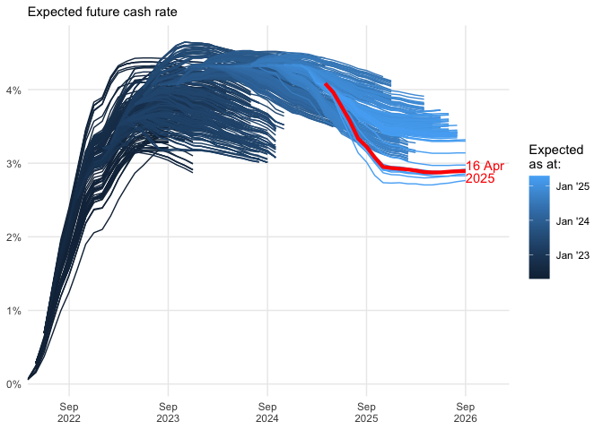
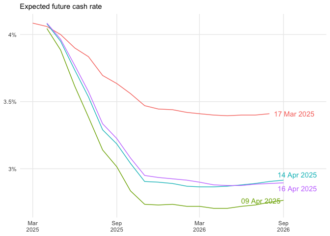
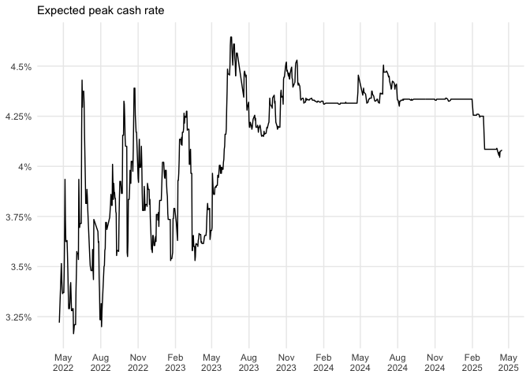
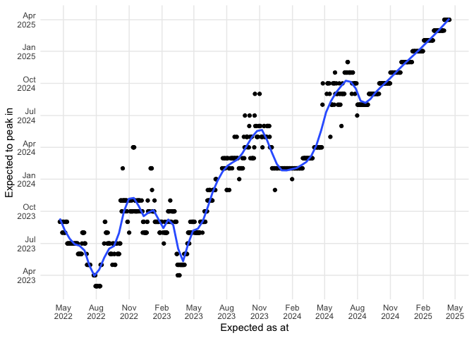
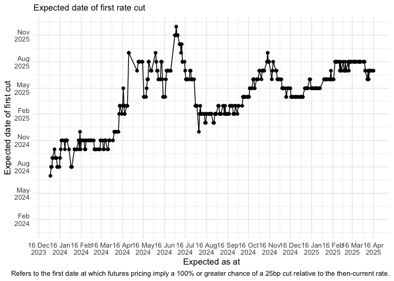

<!-- README.md is generated from README.Rmd. Please edit that file -->

# cash-rate-scraper

The key script in this repo is `R/scrape_cash_rate.R`. This file parses
market expectations for the cash rate based on the [latest ASX cash rate
implied yield
curve](https://www.asx.com.au/markets/trade-our-derivatives-market/futures-market/rba-rate-tracker).

The data is saved as a CSV in `daily_data`. The file
`combined_data/all_data.Rds` contains a dataframe that is the
combination of all the daily data CSVs.

Note that there was a gap in the data collection between 1 July and 20
July, as the ASX changed its website.

I offer no assurance that this will continue to work, or that the data
extracted using this script will be free of errors.

The `.github/workflows/refresh_data.yaml` file contains the instructions
to GitHub Actions to tell it to run `scrape_cash_rate.R` each day and
commit the results in this repo.

Please fork/copy/modify as you see fit.

# Graphs!

The file `R/viz_cash_rate.R` produces visualisations of this data, which
are shown below:

    #> # A tibble: 266 × 4
    #>    date       bucket probability month_label
    #>    <date>     <chr>        <dbl> <chr>      
    #>  1 2025-04-01 0.1%             0 Apr 2025   
    #>  2 2025-04-01 0.35%            0 Apr 2025   
    #>  3 2025-04-01 0.6%             0 Apr 2025   
    #>  4 2025-04-01 0.85%            0 Apr 2025   
    #>  5 2025-04-01 1.1%             0 Apr 2025   
    #>  6 2025-04-01 1.35%            0 Apr 2025   
    #>  7 2025-04-01 1.6%             0 Apr 2025   
    #>  8 2025-04-01 1.85%            0 Apr 2025   
    #>  9 2025-04-01 2.1%             0 Apr 2025   
    #> 10 2025-04-01 2.35%            0 Apr 2025   
    #> # ℹ 256 more rows
    #> [1] "Apr 2025"
    #> Warning: Removed 19 rows containing missing values or values outside the scale range
    #> (`geom_bar()`).
    #> Warning: Removed 1 row containing missing values or values outside the scale range
    #> (`geom_segment()`).
    #> [1] "May 2025"
    #> Warning: Removed 19 rows containing missing values or values outside the scale range
    #> (`geom_bar()`).
    #> Removed 1 row containing missing values or values outside the scale range
    #> (`geom_segment()`).
    #> [1] "Jul 2025"
    #> Warning: Removed 19 rows containing missing values or values outside the scale range
    #> (`geom_bar()`).
    #> Removed 1 row containing missing values or values outside the scale range
    #> (`geom_segment()`).
    #> [1] "Aug 2025"
    #> Warning: Removed 19 rows containing missing values or values outside the scale range
    #> (`geom_bar()`).
    #> Removed 1 row containing missing values or values outside the scale range
    #> (`geom_segment()`).
    #> [1] "Sep 2025"
    #> Warning: Removed 19 rows containing missing values or values outside the scale range
    #> (`geom_bar()`).
    #> Removed 1 row containing missing values or values outside the scale range
    #> (`geom_segment()`).
    #> [1] "Nov 2025"
    #> Warning: Removed 19 rows containing missing values or values outside the scale range
    #> (`geom_bar()`).
    #> Removed 1 row containing missing values or values outside the scale range
    #> (`geom_segment()`).
    #> [1] "Dec 2025"
    #> Warning: Using `size` aesthetic for lines was deprecated in ggplot2 3.4.0.
    #> ℹ Please use `linewidth` instead.
    #> This warning is displayed once every 8 hours.
    #> Call `lifecycle::last_lifecycle_warnings()` to see where this warning was
    #> generated.

<!-- --><!-- --><!-- --><!-- -->

    #> Warning: Removed 126 rows containing missing values or values outside the scale range
    #> (`geom_point()`).
    #> Warning: Removed 126 rows containing missing values or values outside the scale range
    #> (`geom_line()`).

<!-- -->
